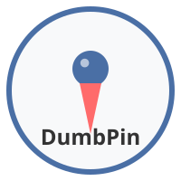

# DumbPin - Your Interactive Visual Collaboration Tool 🎯

DumbPin is inspired by but related to DumbWare.io.  I am creating a tool that allows users to create interactive maps and pin points on them. The goal is to make it easy for users to create maps and pin points on them. The tool should be easy to use and intuitive.

DumbPin revolutionizes the way you interact with images and maps! Whether you're planning a tour, sharing photography spots, or tracking your travels, DumbPin makes visual collaboration simple and fun.



## Why DumbPin? ✨

- 🖼️ **Interactive Image Pinning**: Transform any image into an interactive canvas
- 🌍 **Map Magic**: Create custom maps with personalized markers
- 🎨 **Creative Freedom**: Customize pins, labels, and legends to match your style
- 🤝 **Collaborative Spirit**: Share your creations and let others contribute
- 📥 **Save & Share**: Download your masterpiece with all pins intact

## Exciting Use Cases 🚀

### For Tour Guides 🗺️
Create interactive city maps with pins marking your tour stops. Share with customers for a sneak peek of their adventure!

### For Photographers 📸
Build a visual guide of the best photo spots, color-coded for morning and evening shots. Share your expertise with fellow photographers.

### For World Travelers ✈️
Mark your visited destinations and dream locations. Watch your travel map grow with every adventure!

### For Event Organizers 🎉
Let conference attendees pin their locations. Create a stunning visual of your event's global reach.

## Getting Started 🛠️

### Prerequisites
- Node.js (>=20.0.0)
- npm (comes with Node.js)

### Installation
1. Clone the repository:
   ```bash
   git clone https://github.com/yourusername/dumbPin.git
   cd dumbPin
   ```

2. Install dependencies:
   ```bash
   npm install
   ```

3. Set up environment variables:
   ```bash
   cp .env.example .env
   ```
   Then edit the `.env` file with your specific configuration.

4. Start the development server:
   ```bash
   npm run dev
   ```
   This will start both the backend and frontend development servers.

## Usage 🚀

### Creating Your First Pin Board
1. Navigate to the home page
2. Click "Create New Board"
3. Upload an image or select a map
4. Start adding pins by clicking on the image
5. Customize your pins with labels and descriptions
6. Save your board and share the unique URL

### Keyboard Shortcuts
- `Ctrl+Z` / `Cmd+Z`: Undo last action
- `Ctrl+S` / `Cmd+S`: Save board
- `P`: Enter pin placement mode
- `Esc`: Cancel current action

## Features in Detail 🌟

### Pin Customization
- Choose from various pin styles and colors
- Add custom labels with rich text formatting
- Include images and links in pin descriptions

### Collaboration Tools
- Real-time collaboration with team members
- Comment threads on individual pins
- Version history to track changes

### Export Options
- Download as high-resolution image
- Export data in JSON format
- Print-friendly layouts

## Project Structure 📁

```
├── backend/         # Express server and API
├── frontend/        # Web client
├── shared/          # Shared assets and utilities
└── docs/            # Documentation
```

## Contributing 🤝

We welcome contributions from the community! Here's how you can help:

1. Fork the repository
2. Create your feature branch: `git checkout -b feature/amazing-feature`
3. Commit your changes: `git commit -m 'Add some amazing feature'`
4. Push to the branch: `git push origin feature/amazing-feature`
5. Open a Pull Request

Please make sure to update tests as appropriate and follow our coding standards.

## License 📝

This project is licensed under the Creative Commons Attribution (CC BY) License - see the [LICENSE.md](LICENSE.md) file for details.

## Support 💬

Having trouble with DumbPin? Check out our documentation or contact our support team at support@DumbPin.example.com.

---

Made with ❤️ by the DumbPin Team